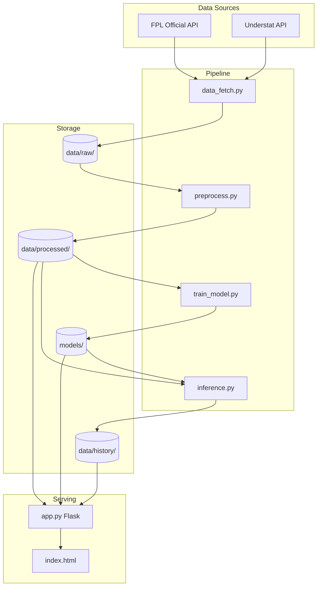

# FPL-ML System Analysis

This document provides a comprehensive evaluation of the FPL Underdog Predictor system architecture, machine learning approach, and overall code quality.

---

## Executive Summary

The system is a well-structured FPL (Fantasy Premier League) player points predictor that:
- Fetches data from official FPL API and Understat for advanced metrics (xG, xGA)
- Trains position-specific RandomForest models
- Selects "underdog" picks based on cost, ownership, and form constraints
- Deploys as a Flask web app with automated weekly updates via GitHub Actions

**Overall Assessment**: The system is functional and demonstrates good software engineering practices. However, there are significant opportunities to improve model performance, data engineering robustness, and prediction accuracy.

---

## What Works Well

### 1. Clean Modular Architecture
- Clear separation of concerns across modules: `data_fetch.py`, `preprocess.py`, `train_model.py`, `inference.py`, `app.py`
- Centralized configuration in `src/config.py` makes feature management maintainable
- Good use of docstrings explaining each module's purpose

### 2. Position-Specific Models
- Training separate RandomForest models for GKP, DEF, MID, FWD is a **good choice**
- Each position has tailored features (e.g., `recent_saves` for GKP, `recent_threat` for FWD)
- Appropriate regularization with `min_samples_leaf` to prevent overfitting

### 3. Intelligent Feature Engineering
- Rolling 5-game averages with proper **lagging** (shift by 1) prevents data leakage
- Incorporates Understat xG/xGA at the team level
- Uses player-level expected stats (`recent_expected_goals`, `recent_expected_assists`)

### 4. Automated Pipeline & CI/CD
- GitHub Actions workflow (`weekly_update.yml`) runs every 6 hours
- Smart deadline checking before triggering full pipeline
- Automatic commit of updated models and predictions

### 5. Underdog Selection Logic
- Selection constraints (MAX_COST=80, MAX_OWNERSHIP=10%) are well-defined
- Fallback logic when strict filters yield no results
- Avoids same team+position duplicates in wildcard selection

### 6. Prediction History Tracking
- `history.py` logs predictions per gameweek with actual points backfill
- Enables rolling accuracy metrics (5-GW hit rate on frontend)

---

## What Does Not Work / Areas for Improvement

### 1. Model Choice Limitations

> [!NOTE]
> ✅ **RESOLVED (Jan 2026)**: Switched to LightGBM with TimeSeriesSplit cross-validation.

| Original Issue | Resolution |
|-------|--------|
| RandomForest with 200 trees | ✅ Replaced with LightGBM gradient boosting |
| No hyperparameter tuning | ✅ Added `learning_rate`, `subsample`, `colsample_bytree` |
| No cross-validation | ✅ Implemented 5-fold TimeSeriesSplit for temporal integrity |

---

### 2. Target Variable Issues

> [!CAUTION]
> `total_points` as the target is inherently noisy and hard to predict accurately.

- FPL points have high variance due to bonus points, clean sheets, and random events
- The system predicts raw points, not probabilities of specific outcomes
- No decomposition into sub-targets (goals, assists, clean sheets, etc.)

**Recommendation**: Consider predicting component outcomes separately and aggregating, or use a more robust target like "points above replacement."

---

### 3. Data Leakage Risk in Rolling Features

```python
# preprocess.py line 299-300
train_df[f'prev_{metric}'] = train_df.groupby('element')[metric].shift(1)
train_df[col_name] = train_df.groupby('element')[f'prev_{metric}'].transform(lambda x: x.rolling(window=5, min_periods=1).mean())
```

The shift approach is **correct**, but:
- Training uses **full season data** without temporal awareness
- Model could see "future" data patterns if train/test split is random rather than temporal

**Recommendation**: Use `TimeSeriesSplit` or explicit temporal cutoff for train/test to prevent subtle leakage.

---

### 4. Limited Use of Understat Player-Level Data

Current implementation:
- Fetches team-level xG/xGA from Understat matches
- Uses `recent_expected_goals`, `recent_expected_assists` from FPL API (not Understat)

Missing opportunities:
- Player-specific xG, xA, key passes from Understat
- Match-by-match player shots data
- NPxG (non-penalty xG) which is more predictive

**Recommendation**: Integrate Understat player-level data via the `id_map.py` mapping for richer features.

---

### 5. Hardcoded Selection Thresholds

```python
# src/config.py
MAX_COST = 80       # £8.0m
MAX_OWNERSHIP = 10  # 10%
MIN_FORM = 2.0
MIN_ICT = 3.0
```

- These are static and may not adapt to season dynamics
- No explanation of how these values were chosen
- Could filter out good picks early/late in season

**Recommendation**: Make thresholds configurable or data-driven (e.g., percentile-based).

---

### 6. No Model Validation Metrics Stored

```python
# train_model.py - MAE is printed but not persisted
print(f"{config['name']} Model MAE: {mae:.4f}")
```

- No historical record of model performance over time
- Cannot track if model is improving or degrading
- No automated alerting for performance drops

**Recommendation**: Log metrics to JSON/CSV file and add monitoring.

---

### 7. Feature Importance Not Analyzed

- No SHAP values or feature importance extraction
- Unclear which features actually drive predictions
- Makes it hard to debug poor predictions

**Recommendation**: Add feature importance logging and optionally expose in the UI.

---

### 8. App.py Dead Code

```python
# app.py lines 170-173 (unreachable after return statement)
result_df = pd.DataFrame(final_picks)
return format_predictions_response(result_df, metadata)
```

This code is never executed due to the earlier `return` on line 168.

**Recommendation**: Remove this dead code block.

---

### 9. Fuzzy Matching for Team Names

```python
# preprocess.py line 91
match = process.extractOne(us_name, fpl_names)
```

- Fuzzy matching (fuzzywuzzy) can produce incorrect mappings
- Already improved with `id_map.py` persistent JSON approach
- But `map_understat_teams()` in preprocess still uses fuzzy matching

**Recommendation**: Ensure `id_map.py` mappings are used consistently everywhere.

---

### 10. No Uncertainty Quantification

- Predictions are point estimates with no confidence intervals
- Users have no sense of which predictions are "confident" vs "risky"
- RandomForest can provide prediction intervals via tree variance

**Recommendation**: Add prediction confidence/uncertainty to output.

---

## Architecture Diagram



---

## Summary of Recommendations

| Category | Priority | Recommendation |
|----------|----------|----------------|
| Model | ~~High~~ | ✅ **Done**: Switched to LightGBM with TimeSeriesSplit CV |
| Data | ~~High~~ | ✅ **Done**: TimeSeriesSplit implemented (part of Model fix) |
| Features | Medium | Integrate Understat player-level xG/xA data |
| Metrics | Medium | Store model MAE over time for monitoring |
| Code | Low | Remove dead code in `app.py` |
| UX | Medium | Add prediction confidence intervals |
| Config | Low | Make selection thresholds data-driven |

---

## Conclusion

The FPL-ML system is a solid foundation with good engineering practices. The main opportunities for improvement lie in:

1. **Model sophistication** - gradient boosting + temporal CV
2. **Richer features** - player-level Understat data
3. **Better validation** - stored metrics, feature importance
4. **User experience** - confidence intervals, explainability

These changes could meaningfully improve prediction accuracy and user trust in the system.
