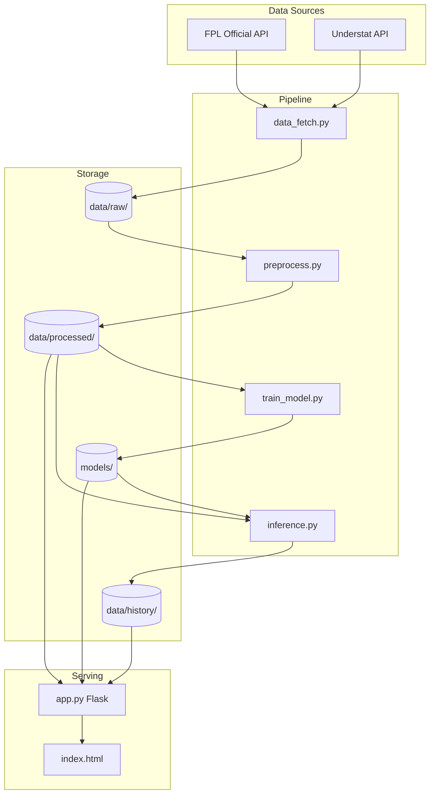

# FPL-ML System Analysis

This document provides a comprehensive evaluation of the FPL Underdog Predictor system architecture, machine learning approach, and overall code quality.

---

## Executive Summary

The system is a well-structured FPL (Fantasy Premier League) player points predictor that:
- Fetches data from official FPL API and Understat for advanced metrics (xG, xGA)
- Trains position-specific RandomForest models
- Selects "underdog" picks based on cost, ownership, and form constraints
- Deploys as a Flask web app with automated weekly updates via GitHub Actions

**Overall Assessment**: The system is functional and demonstrates good software engineering practices. However, there are significant opportunities to improve model performance, data engineering robustness, and prediction accuracy.

---

## What Works Well

### 1. Clean Modular Architecture
- Clear separation of concerns across modules: `data_fetch.py`, `preprocess.py`, `train_model.py`, `inference.py`, `app.py`
- Centralized configuration in `src/config.py` makes feature management maintainable
- Good use of docstrings explaining each module's purpose

### 2. Position-Specific Models
- Training separate RandomForest models for GKP, DEF, MID, FWD is a **good choice**
- Each position has tailored features (e.g., `recent_saves` for GKP, `recent_threat` for FWD)
- Appropriate regularization with `min_samples_leaf` to prevent overfitting

### 3. Intelligent Feature Engineering
- Rolling 5-game averages with proper **lagging** (shift by 1) prevents data leakage
- Incorporates Understat xG/xGA at the team level
- Uses player-level expected stats (`recent_expected_goals`, `recent_expected_assists`)

### 4. Automated Pipeline & CI/CD
- GitHub Actions workflow (`weekly_update.yml`) runs every 6 hours
- Smart deadline checking before triggering full pipeline
- Automatic commit of updated models and predictions

### 5. Underdog Selection Logic
- Selection constraints (MAX_COST=80, MAX_OWNERSHIP=10%) are well-defined
- Fallback logic when strict filters yield no results
- Avoids same team+position duplicates in wildcard selection

### 6. Prediction History Tracking
- `history.py` logs predictions per gameweek with actual points backfill
- Enables rolling accuracy metrics (5-GW hit rate on frontend)

---

## What Does Not Work / Areas for Improvement

### 1. Model Choice Limitations

> [!NOTE]
> ✅ **RESOLVED (Jan 2026)**: Switched to LightGBM with TimeSeriesSplit cross-validation.

| Original Issue | Resolution |
|-------|--------|
| RandomForest with 200 trees | ✅ Replaced with LightGBM gradient boosting |
| No hyperparameter tuning | ✅ Added `learning_rate`, `subsample`, `colsample_bytree` |
| No cross-validation | ✅ Implemented 5-fold TimeSeriesSplit for temporal integrity |

---

### 2. Target Variable Issues

> [!NOTE]
> ✅ **RESOLVED (Jan 2026)**: Implemented component-based prediction.

| Original Issue | Resolution |
|-------|--------|
| `total_points` too noisy | ✅ Predict goals, assists, clean sheets separately |
| Predicts raw points | ✅ Predict probabilities, aggregate using FPL scoring rules |
| No decomposition | ✅ LGBMClassifier for each component per position |

**New Approach**:
- Train separate classifiers for P(goal), P(assist), P(clean sheet)
- Expected Points = P(goal) × goal_pts + P(assist) × 3 + P(cs) × cs_pts + 2
- Keeps legacy regressor as fallback for comparison

**Phase 2 (Indefinitely Deferred)**: Additional components were considered but deferred due to complexity vs. impact trade-offs:
- **Bonus Points**: Requires 30+ in-match BPS stats not available pre-match
- **GKP Saves**: Dependent on unpredictable opponent shot volume
- **Penalty Events**: Too rare (~2% of matches) for reliable classification
- **Goals Conceded**: Would require Poisson regression + model inversion
- **Multi-Goal/Assist**: Current binary (0/1+) captures ~80% of expected value

See `architectural_decisions.md` Section 8 for full rationale.

---

### 3. Data Leakage Risk in Rolling Features

> [!NOTE]
> ✅ **RESOLVED (Jan 2026)**: Implemented TimeSeriesSplit cross-validation.

| Original Issue | Resolution |
|-------|--------|
| Training uses full season data without temporal awareness | ✅ Implemented 5-fold TimeSeriesSplit cross-validation |
| Model could see "future" data patterns with random splits | ✅ Temporal integrity ensured via `TimeSeriesSplit(n_splits=5)` |

```python
# preprocess.py line 299-300
train_df[f'prev_{metric}'] = train_df.groupby('element')[metric].shift(1)
train_df[col_name] = train_df.groupby('element')[f'prev_{metric}'].transform(lambda x: x.rolling(window=5, min_periods=1).mean())
```

The shift approach is **correct**, and the temporal integrity concern has been addressed:
- ~~Training uses **full season data** without temporal awareness~~ → **Fixed**
- ~~Model could see "future" data patterns if train/test split is random rather than temporal~~ → **Fixed**

**Implementation**: `TimeSeriesSplit(n_splits=5)` is now used in `train_model.py` for all position models.

---

### 4. Limited Use of Understat Player-Level Data

> [!NOTE]
> ✅ **RESOLVED (Jan 2026)**: Integrated Understat player-level xG/xA data.

| Original Issue | Resolution |
|-------|--------|
| Only team-level xG/xGA from Understat | ✅ Now uses player-level stats via `id_map.py` mapping |
| Missing player-specific xG, xA | ✅ Added `us_npxG_per90`, `us_xA_per90` per-90 metrics |
| NPxG (non-penalty xG) not used | ✅ Integrated `npxG` from Understat player data |

**Implementation**:
- `preprocess.py` loads `understat_players_{season}.json` and `id_mapping.csv`
- Calculates per-90 metrics: `us_npxG_per90 = (npxG / time) * 90`
- Merges to training/inference data via FPL↔Understat ID mapping
- `config.py` updated: MID/FWD positions now use `recent_us_npxG_per90`, `recent_us_xA_per90`

See `architectural_decisions.md` Section 1.3 for full details.

---

### 5. Hardcoded Selection Thresholds

> [!NOTE]
> ✅ **RESOLVED (Jan 2026)**: Replaced static thresholds with percentile-based dynamic calculation.

| Original Issue | Resolution |
|-------|--------|
| `MAX_COST = 80` (static £8.0m) | ✅ Now computed as 75th percentile (floor £7.0m) |
| `MAX_OWNERSHIP = 10` (static 10%) | ✅ Now computed as 50th percentile (floor 10%) |
| `MIN_FORM = 2.0` (static) | ✅ Now computed as 30th percentile of current week's form |
| `MIN_ICT = 3.0` (static) | ✅ Now computed as 30th percentile of current week's ICT |
| Static logic implies strict cutoff | ✅ Implemented "Fail Upward" logic: Prioritize points over constraints |

**Implementation**:
- `config.py` now defines `OWNERSHIP_PERCENTILE`, `COST_PERCENTILE`, `FORM_PERCENTILE`, `ICT_PERCENTILE`
- `inference.py` added `calculate_dynamic_thresholds(df)` function
- Thresholds are logged at inference time for transparency

See `architectural_decisions.md` Section 9 for full rationale.

---

### 6. No Model Validation Metrics Stored

> [!NOTE]
> ✅ **RESOLVED (Jan 2026)**: Implemented persistent metrics logging.

| Original Issue | Resolution |
|-------|--------|
| No model history | ✅ Metrics (AUC/MAE) now logged to `data/history/model_metrics.json` |
| No performance tracking | ✅ JSON store enables longitudinal analysis of model accuracy |

**Implementation**:
- `src/train_model.py` now logs validation metrics after every run
- JSON format captures component-level performance (goals, assists, cleansheets)

See `architectural_decisions.md` Section 3.4 for details.

---

### 7. Feature Importance Not Analyzed

> [!NOTE]
> ✅ **RESOLVED (Jan 2026)**: Implemented feature importance logging and UI.

| Original Issue | Resolution |
|-------|--------|
| No SHAP values or feature importance | ✅ Logged LightGBM `feature_importances_` to JSON |
| Unclear which features drive predictions | ✅ Added `/feature-importance` dashboard to UI |
| Hard to debug poor predictions | ✅ Visualized top contributing features per component |

**Implementation**:
- `train_model.py` saves importance to `data/history/feature_importance.json`
- `app.py` exposes `/feature-importance` route
- New visualization page shows contribution of features like `recent_team_xga`, `recent_form`, etc.

See `architectural_decisions.md` Section 3.5 for details.

---

### 8. App.py Dead Code

> [!NOTE]
> ✅ **RESOLVED (Jan 2026)**: Removed dead code block.

| Original Issue | Resolution |
|-------|--------|
| Unreachable code in `app.py` | ✅ Removed lines 201-204 (formerly 170-173) |

---

### 9. Fuzzy Matching for Team Names

> [!NOTE]
> ✅ **RESOLVED (Jan 2026)**: Replaced fuzzy matching with persistent JSON mapping.

| Original Issue | Resolution |
|-------|--------|
| `map_understat_teams()` uses fuzzy matching | ✅ Now uses `known_team_mapping.json` lookup |
| Can produce incorrect mappings | ✅ Explicit mapping of 6 mismatched team names |
| Inconsistent with `id_map.py` approach | ✅ Both now use persistent JSON files |

**Implementation**:
- Created `data/config/known_team_mapping.json` with Understat→FPL team name mappings
- Refactored `map_understat_teams()` to use JSON lookup with exact match fallback
- Removed dependency on fuzzy matching for team name resolution

---

### 10. No Uncertainty Quantification

> [!NOTE]
> ✅ **RESOLVED (Jan 2026)**: Added prediction confidence scoring and visualization.

| Original Issue | Resolution |
|-------|--------|
| Predictions are point estimates | ✅ Added `confidence_score` (0-100%) based on probability decisiveness |
| No sense of "confident" vs "risky" | ✅ Min Points column color-coded: Green (≥70%), Yellow (40-69%), Orange (<40%) |
| RandomForest prediction intervals | ✅ Component probabilities provide natural uncertainty measure |

**Approach**:
- Confidence calculated as: `mean(|p - 0.5| × 2)` for each component probability
- Probabilities near 0 or 1 indicate certainty → high confidence
- Probabilities near 0.5 indicate uncertainty → low confidence

**Implementation**:
- `inference.py`: Added `calculate_confidence()` function
- `app.py`: Exposed `confidence_score` in API response
- `index.html`: Color-coded Min Points column with legend

**Enhancement (Jan 2026)**: Confidence scores now also influence player selection via the "Confidence First" fail-upward cascade. See `architectural_decisions.md` Section 11.

---

## Architecture Diagram



---

## Summary of Recommendations

| Category | Priority | Recommendation |
|----------|----------|----------------|
| Model | ~~High~~ | ✅ **Done**: Switched to LightGBM with TimeSeriesSplit CV |
| Target | ~~High~~ | ✅ **Done**: Component-based prediction (goals, assists, clean sheets) |
| Data | ~~High~~ | ✅ **Done**: TimeSeriesSplit implemented (part of Model fix) |
| Features | ~~Medium~~ | ✅ **Done**: Integrated Understat player-level xG/xA data |
| Metrics | ~~Medium~~ | ✅ **Done**: Store model MAE/AUC in `model_metrics.json` |
| Code | ~~Low~~ | ✅ **Done**: Removed dead code in `app.py` |
| UX | ~~Medium~~ | ✅ **Done**: Confidence scoring with color-coded Min Points column |
| Config | ~~Low~~ | ✅ **Done**: Dynamic percentile-based selection thresholds |
| Selection | ~~High~~ | ✅ **Done (Apr 2026)**: P(≥6) ranking — optimizes directly for the 6+ hit target |
| Calibration | ~~High~~ | ✅ **Done (Apr 2026)**: 60/40 component+legacy blending reduces over-prediction |
| Config | ~~Medium~~ | ✅ **Done (Apr 2026)**: Raised prediction cap (9→14), confidence floor (50→60) |
| Data | ~~Medium~~ | ✅ **Done (Apr 2026)**: Full predictions log now gets actuals backfilled |

---

## Conclusion

The FPL-ML system has evolved through three major phases:

1. **Jan 2026**: Model sophistication — gradient boosting, temporal CV, component-based prediction
2. **Feb-Mar 2026**: Selection refinement — confidence scoring, position limits, cost caps
3. **Apr 2026**: Target alignment — P(≥6) selection metric, prediction blending, cap/confidence tuning

The April 2026 changes address the fundamental misalignment between the optimization metric (expected points) and the project goal (6+ point hits). The system now selects players based on their probability of reaching the 6-point threshold rather than their expected point total.

See `architectural_decisions.md` Section 17 for full details on the April 2026 review.

