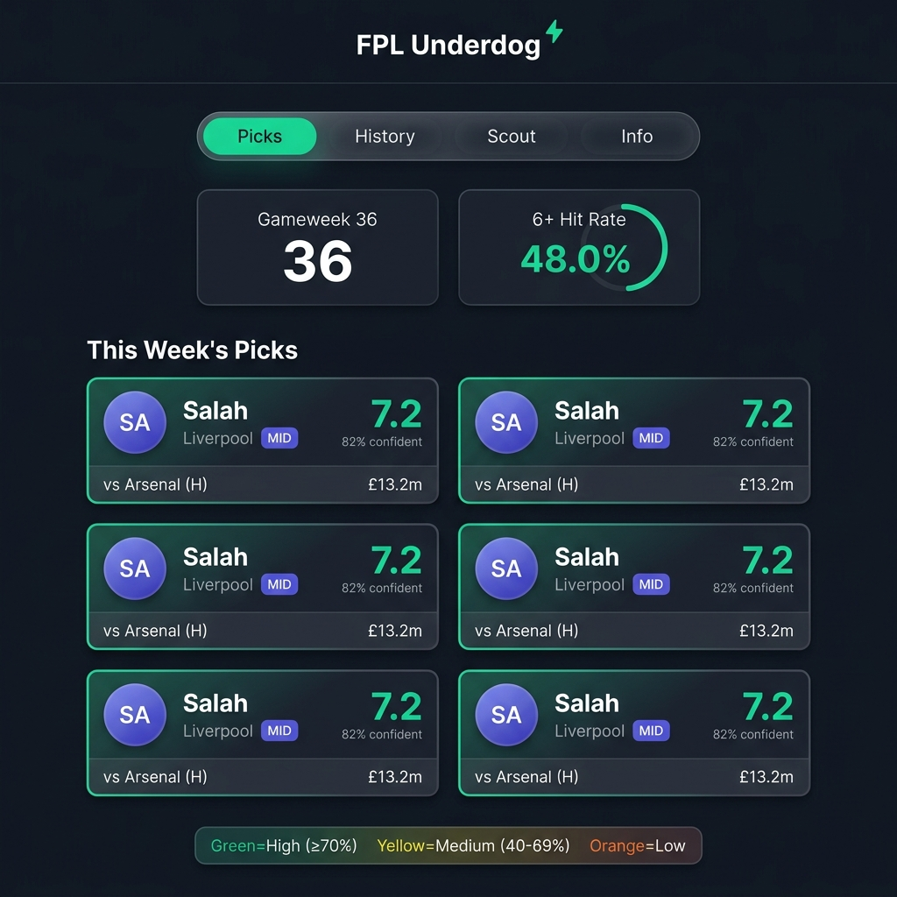
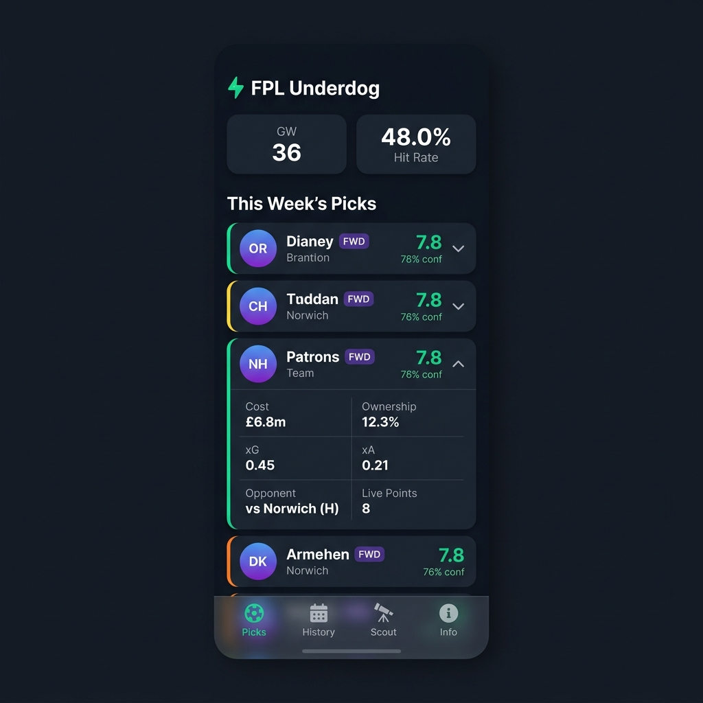
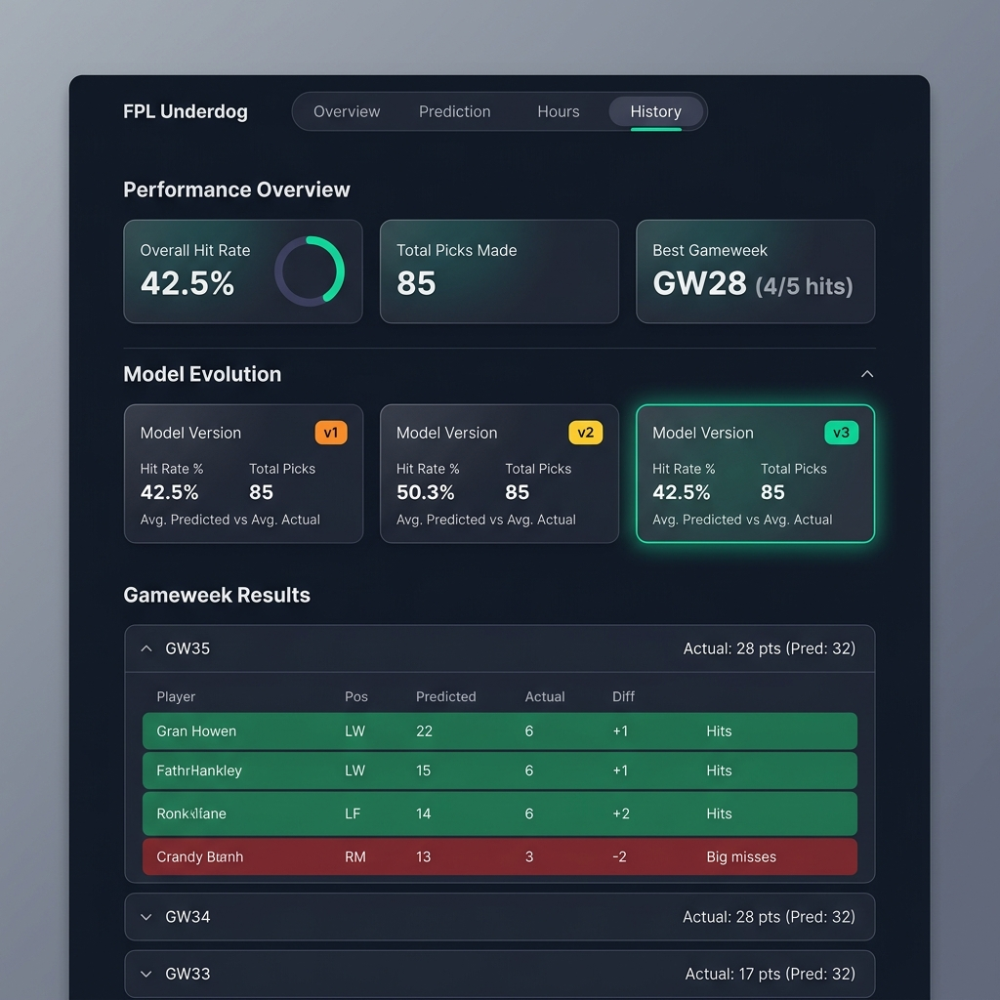
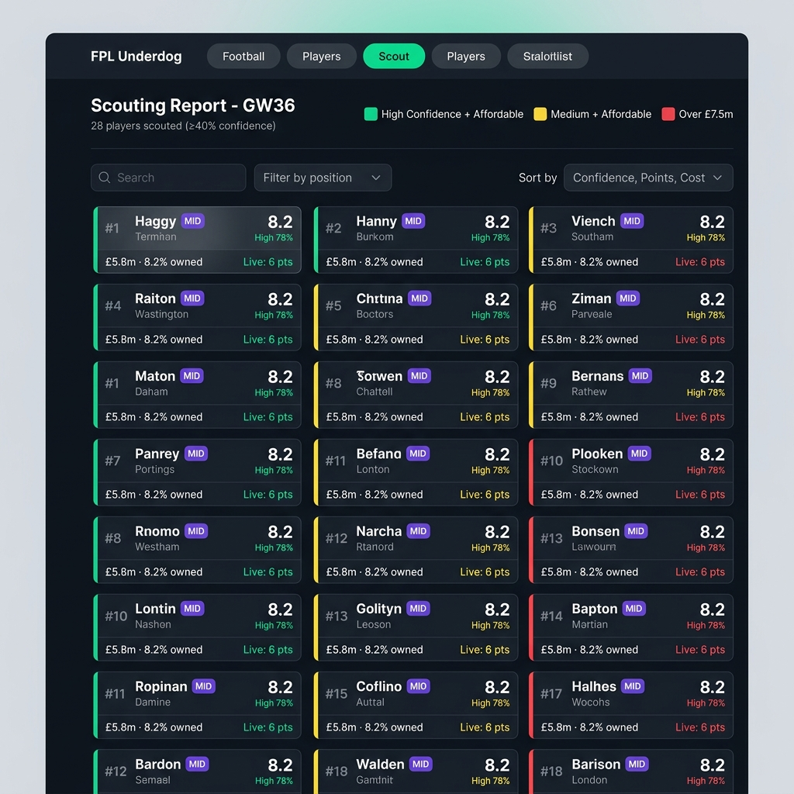

# FPL Underdog — UI Redesign Proposals

> **Status**: Pinned for later implementation  
> **Created**: 2026-04-29  

---

## Current Issues

### Critical
1. **Monolithic 2,000-line HTML file** — CSS, HTML, and JS all in `src/templates/index.html`
2. **Desktop table is hidden** — Lines 926-928 set `display: none` on the table; desktop shows cards only
3. **No visual hierarchy on Picks page** — All 5 player cards look identical; no way to distinguish the "star" pick from the wildcard
4. **Hit Rate card lacks context** — "48.0%" is meaningless without a visual benchmark
5. **Broken HTML in credits** — Line 1334: missing `<` in closing `<p>` tag

### Usability Gaps
1. **Scout tab has no filtering/sorting** — Users manually scan 30 cards with no position filter or sort
2. **No "at a glance" summary on History** — Must expand every gameweek to see results; no trend chart
3. **Confidence legend is disconnected** — Green/yellow/orange legend is far from the cards it explains
4. **No loading skeletons** — Plain "Loading..." text instead of animated skeleton screens
5. **No empty state design** — Just gray "No data" text when data is missing

---

## Proposed Design System

### Color Palette
```
--primary-bg:      #0f1419   (deep navy-charcoal, softer than current #1a1a1a)
--secondary-bg:    #1a2332   (subtle blue tint for depth)
--card-bg:         #1e2a3a   (glassmorphism base)
--border-color:    rgba(255,255,255,0.06)
--accent-green:    #00e5a0   (warmer than current #00ff85, easier on eyes)
--accent-purple:   #6c5ce7   (more vibrant than current #37003c)
--text-primary:    #f0f0f0
--text-secondary:  #8899aa
```

### Typography
- **Headlines**: `'Outfit', sans-serif` (already loaded)
- **Body/Data**: `'Inter', sans-serif` (add via Google Fonts)
- **Monospace stats**: `'JetBrains Mono', monospace` (add via Google Fonts)

### Visual Effects
- **Glassmorphism**: `backdrop-filter: blur(12px)` + semi-transparent backgrounds on cards and nav
- **Confidence borders**: Colored left border on player cards (green/yellow/orange)
- **Circular progress ring**: SVG-based ring on the Hit Rate card
- **Skeleton loading**: Animated gradient shimmer placeholders

---

## Mockups

### Desktop — Picks Tab


### Mobile — Picks Tab


### Desktop — History Tab


### Desktop — Scout Tab


---

## Proposed Changes by Tab

### Picks Tab
- [ ] Pill-style tab navigation with active state glow
- [ ] Circular progress ring SVG on Hit Rate card
- [ ] Confidence-colored left borders on player cards
- [ ] Better card layout with spatially grouped player info, stats, and prediction
- [ ] Glassmorphism cards with subtle border glow
- [ ] Inline confidence badge (remove separate legend)

### History Tab
- [ ] Performance Overview section: 3 metric cards (Overall Hit Rate, Total Picks, Best Gameweek)
- [ ] Richer Model Evolution cards with colored version badges, current best highlighted
- [ ] Show actual vs predicted in gameweek accordion summary line
- [ ] Color-coded rows in expanded tables (green = hit ≥6pts, red = miss)

### Scout Tab
- [ ] Position filter dropdown (GKP / DEF / MID / FWD / All)
- [ ] Sort dropdown (Confidence, Points, Cost)
- [ ] Rank numbers (#1, #2...) on each card
- [ ] Live points integrated into each card
- [ ] 3-column grid layout for efficient scanning

### Mobile
- [ ] Frosted glass bottom navigation bar
- [ ] Expanded card reveals clean 2×3 stat grid
- [ ] Compact stat pills for GW + Hit Rate
- [ ] Inline confidence indicator with predicted points

---

## Implementation Phases

### Phase 1: Quick Wins (1-2 hours)
- Fix broken HTML credits (line 1334)
- Update CSS variables to new color palette
- Add circular progress ring SVG to Hit Rate card
- Add `backdrop-filter: blur()` glassmorphism to cards and nav
- Add skeleton loading animations

### Phase 2: UX Improvements (2-3 hours)
- Add position filter + sort dropdown to Scout tab (client-side JS)
- Add Performance Overview summary cards to History page
- Improve confidence display — inline badges instead of separate legend
- Add smooth page transition animations between tabs

### Phase 3: Architecture (3-4 hours)
- Extract CSS into separate `styles.css` file
- Extract JS into separate `app.js` file
- Load Google Fonts properly (Inter, JetBrains Mono)
- Add proper loading skeleton components
- Add empty state illustrations

---

## Notes
- **Highest-impact change**: Color palette + glassmorphism (CSS-only, minimal code changes)
- **Highest-value UX feature**: Scout tab filtering (pure client-side JS, no backend changes)
- **Mockups**: Saved in Antigravity conversation `6854ab00-d966-459a-be12-5e93c57e36e7`
